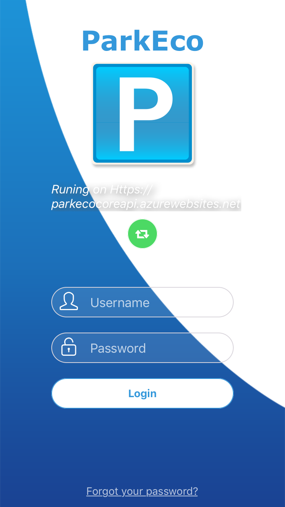
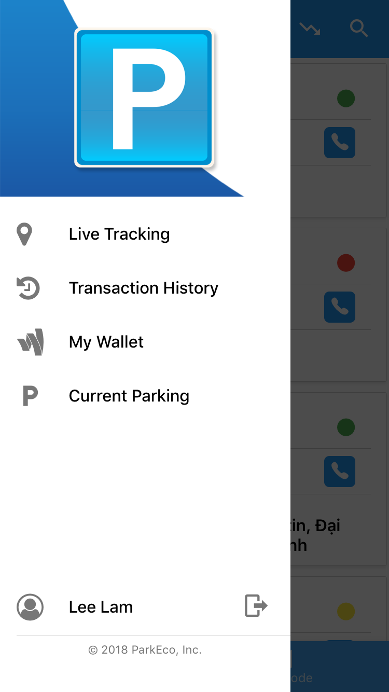
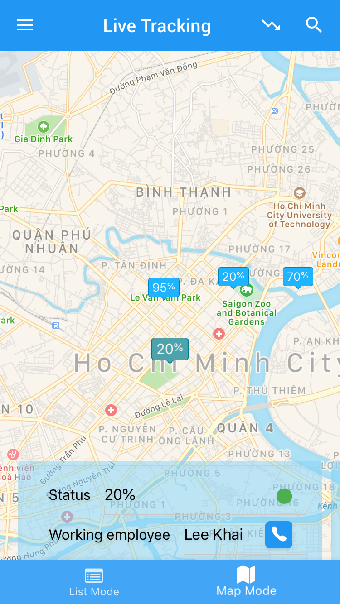

# park-eco-mobile 🗺️🅿️ 
A mobile application for normal users who want to search for **availability of parking** lots before venturing into traffic chaos!

<p align="center">
     
</p>

# Usage
1. Open the application and log in with your credentials.
2. Browse available parking lots and plan **your adventures!** 🌇

# Build from source
Clone this repository to your machine.
```
git clone https://github.com/park-eco/park-eco-mobile-manager.git
```

Make sure you have npm (or yarn) and [react-native-cli](https://www.npmjs.com/package/react-native-cli) installed globally. 

First, restore the packages.
```
npm install 
// or using "yarn install"
``` 

If using Windows, you may want to connect to a physical device or run an emulator first, then run:
```
react-native run-android
```

Alternatively, for iOS:
```
react-native run-ios
```

# Technology stack 📚
- [ReactNative](https://github.com/facebook/react-native) as a powerful cross-platform framework.
- [NativeBase](https://github.com/GeekyAnts/NativeBase), a beautiful UI library for ReactNative applications.

# Contributing
Coming soon.

# Authors
Lam Le, Khai Le, Linh Le, and Phat Nguyen. See also the list of contributors who participated in this project.

# License
This project is licensed under the MIT License - see the [LICENSE.md](LICENSE) file for details

# Design Documentation
The design documentation is currently in 1 language (Vietnamese) [here](https://drive.google.com/file/d/1h9vPLV3zv5bGFUXuRGKPwWl_H1Qbw0sJ/view?usp=sharing).